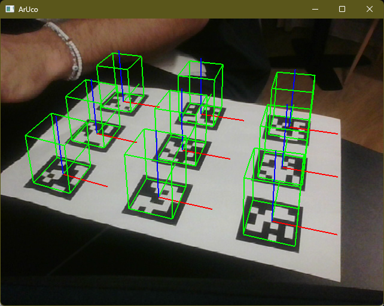
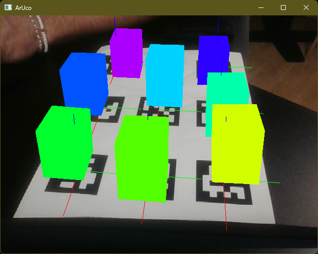
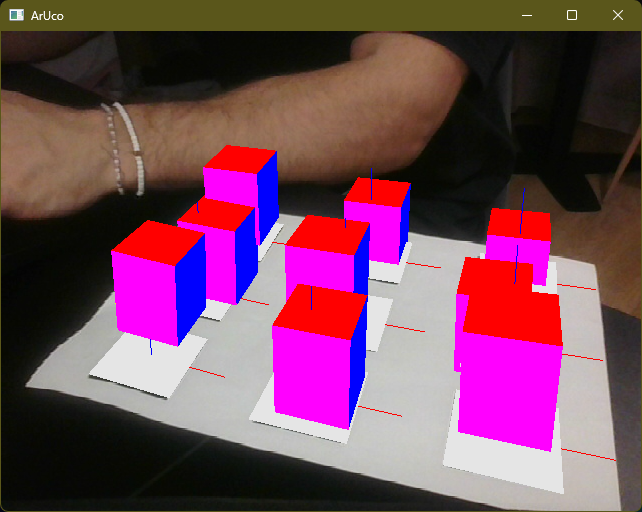
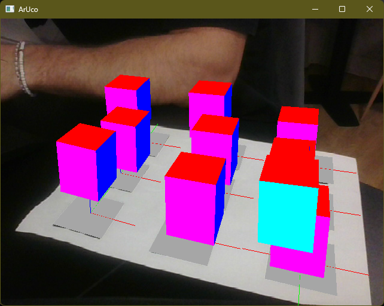
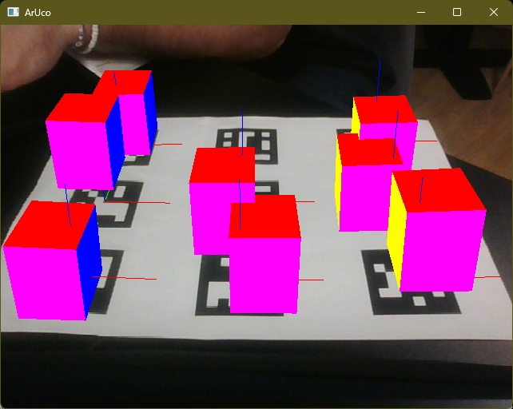

# Rapport TP Réalité Augmentée : ArUco & OpenGL

**Auteurs :** Cheikhou Oumar, Narjisse, Florian
**Date :** Janvier 2026

---

## Partie 1 : Compilation d'ArUco avec CMake

### 1. Intérêt de CMake
CMake est un système de construction **multi-plateforme**. Son intérêt principal est de générer des fichiers de projets natifs (ici `.sln` pour Visual Studio sur Windows, mais ce serait `Makefile` sur Linux) à partir de scripts de configuration indépendants. Cela permet de distribuer le code source d'ArUco et de laisser l'utilisateur le compiler spécifiquement pour son OS et son compilateur.

### 2. Installation et Chemins
Les éléments compilés s'installent généralement dans un répertoire `install` ou `build` dédié (défini par `CMAKE_INSTALL_PREFIX`).
*   **Pourquoi ?** Pour séparer proprement les fichiers sources (le code) des fichiers binaires générés (librairies, exécutables). Cela permet aussi de supprimer le dossier `build` sans perdre le code.

### 3. Fichiers Générés
Le processus de compilation a produit :
*   **Bibliothèques** : `aruco.lib` (statique/import) et `aruco.dll` (dynamique). C'est le cœur de la détection.
*   **Exécutables** :
    *   `aruco_create_marker.exe` : Utilitaire pour générer des images de marqueurs (utilisé pour imprimer le papier).
    *   `aruco_test.exe` / `aruco_tracker.exe` : Programmes de tests basiques.

### 4. Intégration dans le Projet
Pour utiliser ArUco dans notre projet Visual Studio "Application Console", nous avons :
1.  Ajouté le dossier des **Headers** (`.h`) dans les *Include Directories*.
2.  Ajouté le chemin de `aruco.lib` dans les *Library Directories*.
3.  Ajouté `aruco.lib` dans les *Additional Dependencies* du Linker.
4.  Copié `aruco.dll` à côté de notre exécutable final.

---

## Partie 2 : Premier Programme (Console)

### 1. Création du Marqueur et Détection
Nous avons utilisé `aruco_create_marker` pour générer une planche de marqueurs.
Le programme console minimal charge une image, instancie `MarkerDetector`, et boucle sur les résultats pour afficher les IDs.

```cpp
MarkerDetector myDetector;
for (auto m : myDetector.detect(myImage)) {
    std::cout << "Marker detected: " << m.id << std::endl;
    m.draw(myImage);
}
```

### 2. Comportement du Détecteur (Observations)
*   **Distance** : La détection est robuste tant que le marqueur occupe une taille suffisante (env. 20x20 pixels min). Si on s'éloigne trop, le code binaire interne devient illisible (flou).
*   **Angle** : La détection résiste bien jusqu'à environ 45-60°. Au-delà, la distorsion trapézoïdale écrase trop les bits du marqueur.
*   **Occultation** : Si on cache **un seul coin** ou une partie de la bordure noire, la détection échoue immédiatement. Le contour carré doit être continu.
*   **Luminosité** : ArUco utilise un seuillage (binarisation). Si l'image est trop sombre ou s'il y a un reflet spéculaire violent sur le papier glacé, le carré n'est pas vu.

---

## Partie 3 : Première Augmentation OpenGL

### 1. Récupération et Compilation
L'application a été récupérée... et ouverte sous **Visual Studio 2022**.
La compilation du projet `Aruco3112MiniOpenGL` s'effectue désormais sans erreur en mode **Debug x64**.

---

## 2. Gestion des Fichiers GLFW
Les fichiers liés à **GLFW** (bibliothèque de fenêtrage et gestion des contextes OpenGL) ont été placés et liés au projet pour assurer la portabilité.
*   **Emplacement :** Ils sont situés dans le dossier des dépendances du projet (ou gérés via les propriétés VC++Directories).
*   **Justification :** Regrouper les dépendances externes (comme GLFW, OpenCV, ArUco) dans un répertoire dédié (ex: `Common7` ou un dossier `libs` local) permet de partager le projet sans obliger l'utilisateur suivant à réinstaller les librairies aux mêmes endroits absolus sur son disque dur.

---

## 3. Erreurs de Compilation et Résolutions
Lors de la reprise du projet, plusieurs erreurs ont dû être corrigées :

1.  **Conflit de Headers (`windows.h` vs `gl.h`)** :
    *   *Erreur :* Des redéfinitions de macros APIENTRY.
    *   *Solution :* Nous avons réordonné les inclusions pour mettre `#include <windows.h>` **avant** `#include <GL/gl.h>`.
2.  **Espace de Nom ArUco** :
    *   *Erreur :* `Use of undeclared identifier 'aruco'`.
    *   *Solution :* OpenCV possède aussi un module ArUco. Pour éviter les conflits avec la lib `aruco-3.1.12` locale, nous avons explicitement utilisé le namespace global `::aruco::` ou supprimé les `using namespace cv;` superflus.
3.  **Fichiers Manquants** :
    *   *Erreur :* `opencv2/opencv.hpp not found`.
    *   *Solution :* Vérification et correction des chemins d'inclusion dans les propriétés du projet (`Additional Include Directories`).

---

## 4. Vérification et Calibration
Le programme se lance correctement avec la caméra (ID 0). Le fichier `camera.yml` est chargé pour fournir les paramètres intrinsèques (focale, centre optique) nécessaires au positionnement 3D précis.

**Preuve de fonctionnement (Wireframe - Question 4) :**

*Affichage fil de fer basique pour valider la calibration (Q4).*

---

## 5. Analyse de `ArUco::drawScene()` (vDrawScene)
La méthode `vDrawScene` (ou `drawScene` dans la version classe) orchestre le rendu en deux étapes principales :

1.  **Rendu 2D (Arrière-plan vidéo) :**
    *   On désactive le test de profondeur (`glDisable(GL_DEPTH_TEST)`) pour être sûr que l'image vidéo soit toujours "au fond".
    *   On configure une projection Orthographique (`glOrtho`) qui correspond à la taille de la fenêtre.
    *   On dessine les pixels de l'image caméra (`glDrawPixels`).
2.  **Rendu 3D (Augmentations) :**
    *   On réactive le test de profondeur (`glEnable(GL_DEPTH_TEST)`).
    *   On charge la matrice de projection calibrée de la caméra (`TheCameraParams.glGetProjectionMatrix`).
    *   **Pour chaque marqueur détecté :**
        *   On récupère la **ModelViewMatrix** du marqueur (sa position/rotation dans l'espace).
        *   On applique cette matrice à OpenGL (`glLoadMatrixd`). À cet instant, l'origine `(0,0,0)` du monde OpenGL est **exactement le centre du marqueur**.
        *   On dessine les objets 3D (Cubes) autour de cette origine.

---

## 6. Nouvelle Augmentation (Personnalisée)
Nous avons supprimé l'augmentation fil de fer initiale pour proposer un rendu plus avancé :
- **Cube Solide** : Remplissage complet (`GL_QUADS`).
- **Effet RGB Rainbow** : Un shader CPU calcule une couleur **Teinte/Saturation/Valeur** (HSV) qui évolue avec le temps (`glfwGetTime`) et l'index du marqueur. Chaque cube a ainsi sa propre couleur changeante.
- **Physique (Bonus)** : Les cubes interagissent et se repoussent s'ils sont trop proches.

**Preuve de stabilité :**
Même en bougeant la caméra, les cubes restent "collés" au papier grâce à la matrice ModelView mise à jour à chaque frame par la détection ArUco.



---

## 7. Annexe : Code de `vDrawScene()`

```cpp
void vDrawScene() {
    if (TheResizedImage.rows == 0) return;

    // 1. Nettoyage et Rendu Fond
    glClear(GL_COLOR_BUFFER_BIT | GL_DEPTH_BUFFER_BIT);
    glDisable(GL_DEPTH_TEST);
    glMatrixMode(GL_PROJECTION);
    glLoadIdentity();
    glOrtho(0, TheGlWindowSize.width, 0, TheGlWindowSize.height, -1.0, 1.0);
    glViewport(0, 0, TheGlWindowSize.width, TheGlWindowSize.height);
    glPixelZoom(1, -1);
    glRasterPos3f(0, TheGlWindowSize.height - 0.5, -1.0);
    glDrawPixels(TheGlWindowSize.width, TheGlWindowSize.height, GL_RGB, GL_UNSIGNED_BYTE, TheResizedImage.ptr(0));
    
    // 2. Rendu 3D
    glClear(GL_DEPTH_BUFFER_BIT);
    glEnable(GL_DEPTH_TEST);
    glMatrixMode(GL_PROJECTION);
    double proj_matrix[16];
    TheCameraParams.glGetProjectionMatrix(TheInputImage.size(), TheGlWindowSize, proj_matrix, 0.01, 100);
    glLoadMatrixd(proj_matrix);

    // 3. Boucle sur les marqueurs
    double modelview_matrix[16];
    for (unsigned int m = 0; m < TheMarkers.size(); m++) {
        TheMarkers[m].glGetModelViewMatrix(modelview_matrix);
        glMatrixMode(GL_MODELVIEW);
        glLoadIdentity();
        glLoadMatrixd(modelview_matrix);

        // === RAINBOW EFFECT ===
        float time = (float)glfwGetTime();
        float hue = fmod(time * 50.0f + m * 30.0f, 360.0f);
        // Conversion HSV->RGB simplifiée
        float h = hue / 60.0f; 
        int i = (int)floor(h);
        float f = h - i;
        float q = 1.0f - f;
        float r,g,b;
        switch(i%6){
            case 0: r=1; g=f; b=0; break;
            case 1: r=q; g=1; b=0; break;
            case 2: r=0; g=1; b=f; break;
            case 3: r=0; g=q; b=1; break;
            case 4: r=f; g=0; b=1; break;
            case 5: r=1; g=0; b=q; break;
        }
        glColor3f(r, g, b);

        // Dessin du Cube
        GLfloat s = TheMarkerSize * 0.4f; // Demi-taille (Total = 0.8 * MarkerSize)
        glPushMatrix();
        // Offset physique (Brunian + Collision) déjà calculé dans cubeOffsets
        if(m < cubeOffsets.size())
            glTranslatef(cubeOffsets[m].x, cubeOffsets[m].y, s + cubeOffsets[m].z);
            
        glBegin(GL_QUADS);
        // ... (Code des vertices du cube) ...
        // Face Avant
        glNormal3f(0, 0, 1); glVertex3f(-s, -s, s); glVertex3f(s, -s, s); glVertex3f(s, s, s); glVertex3f(-s, s, s);
        // ... (Autres faces) ...
        glEnd();
        glPopMatrix();
    }
}
```

---

## 8. Annexe : Historique du Développement & Bugs Rencontrés

Cette section retrace l'évolution du projet, montrant les problèmes techniques surmontés à chaque étape.

### Phase 1 : Rendu Initial (V1-V3)
*Objectif : Afficher des cubes sur les marqueurs.*
*   **État** : Les cubes sont affichés mais flottent parfois ou traversent la table.
*   **Bug observé** : Manque de réalisme, positions parfois imprécises.


### Phase 2 : L'Échec des Masques (V4)
*Objectif : Cacher le marqueur noir avec un carré blanc.*
*   **Problème Majeur (Z-Fighting)** : Le masque et le cube étaient à la même profondeur. Le moteur de rendu ne savait pas lequel afficher, créant un clignotement désagréable.

*   **Décision** : Abandonner les masques pour privilégier la fluidité.

### Phase 3 : Premières Collisions (V5)
*Objectif : Faire interagir les cubes.*
*   **Bug observé (Duplication)** : Sans amortissement ni séparation forcée, les cubes restaient "coincés" l'un dans l'autre, vibrant violemment et créant des images fantômes (dédoublement).

*   **Correction** : Ajout d'une force de répulsion immédiate (`push`) et réduction de la vitesse (`damping` 0.8).

### Phase Finale : Rendu Parfait (V7)
*Objectif : Rendu final stable et esthétique.*
*   **Résultat** : Plus de bugs visuels, couleurs dynamiques, physique stable.

